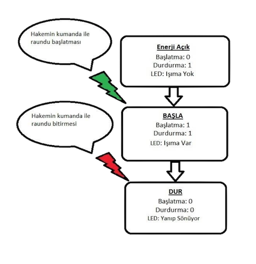

Diğer kategorilerde olduğu gibi Sumo Kategorisi’nde de Genel Kurallar geçerlidir.

# Yarışmanın Amacı
Robotlar belirtilen süre içerisinde birbirlerini, belirtilen dohyo alanı kuralları çerçevesinde alan dışına atmaya çalışmaktadır.

## A) Kategori Kuralları
1. Yarışma esnasında robotu 1 kişi kullanacaktır. Robotlar otonom olacaktır. Yarışma esnasında robotlara dışarıdan müdahale edilemez ve cihazla uzaktan kontrol edilemez.
2. Robotlar, bilgisayar programındaki kuraya göre eşleştirilirler. Aynı ekiplerin robotlarının birbirleriyle eşleşme durumları mümkündür. Bu konuda herhangi bir itiraz kabul edilmeyecektir. Kura sonuçları yayınlandıktan sonra değişimi mümkün değildir.
3. Belirsizlik durumunda hakemlerin kararı geçerlidir.

## B) Dohyo Alanı Kuralları
1. Sumo robot yarışmaları `dohyo` adı verilen mat siyah renkli, dışı beyaz şeritle kaplanmış oyun alanı üzerinde yapılır. Dohyo çelik sacdan olacaktır. Dohyo boyutları: Çapı 150 cm, yarışma zemininin yerden yüksekliği 7cm, dıştaki beyaz çizgi kalınlığı 5cm şeklindedir.
2. Yarışma sırasında robot ile birlikte alana gelen yarışmacı, Okan Üniversitesi Mekatronik Kulübü tarafından belirtilen alanın dışında durmalıdır.

## C) Robotların Teknik Donanım Kuralları
1. Sumo robotlar için taban boyut sınırı müsabakaya başlangıç anı için 20x20 cm’dir. Boyutta hata payı sumo robotlar için %1'dir. (Bu da 2mm'lik hata payına denk gelmektedir)
2. Yükseklik sınırı yoktur.
3. Boyutlar karşılaşma başladıktan sonra değişebilir. Robot müsabakaya baslarken 20x20 cm
tabanına sahip, bir hayali dikdörtgenler prizmasının içine sığabilmelidir.
4. Robotlar otonom olacaktır.
5. Ağırlık sınırı 3 kg’dir. %2’lik hata payı vardır. (60 gr)
6. Boyutlar karşılaşma başladıktan sonra değişebilir.

## D) Robotların Dohyoya Yerleşim Koşulları
1. Her robot kendi grubundaki diğer robotlarla raunt usulü maç yapacaktır. Zemine ilk değen robot kaybeder. Her raunt en fazla 2 dakikadır ve 2 dakikalık süre robotların çalıştırıldığı anda başlar. 2 raundu alan robot maçı kazanır. 3 raunt sonunda eşitlik bozulmamışsa maçın galibi robotların ağırlığına göre (hafif olan robot) belirlenir.
2. Hakem robotun karşılaşmaya hazırlanması için işareti verdikten itibaren 4 dakika içinde ringe gelmeyen robot hükmen yenik sayılır.
3. Hakem hazırlık için işaret verdikten sonra robotlar sahaya şekilde görüldüğü gibi kahverengi çizgiyi geçmeyecek şekilde konur. (Bu çizgi pistte hayali olarak varsayılacaktır) Eğer varsa, robotun ana hareket ekseni bu çizgiye paralel olmalıdır. Aynı maçtaki her raunda raunda robotlar, birbirlerine bakan yüzleri değişerek başlayacaktır.

## E) Robotların Yapımındaki Yasak Maddeler
1. Çalışma dalga boyunu (frekansını) etkileyen, rakibin çalışmasını etkileyen (flaşör, ışık gibi) her türlü parça yasaklanmıştır.
2. Robotlar insanlara, rakip robota ve dohyoya kasıtlı şekilde zarar veremezler. (Yarışma sırasındaki çarpışmalardan dolayı meydana gelen hasarlar sayılmayacaktır.)
3. Rakibe karşı saldırı mekanizması ya da silah olarak kullanılmak üzere sıvı, gaz ya da tozlar yasaktır.
4. Yanıcı maddeler robota takılamaz.
5. Robotlarda kullanılan bataryalar rakip robota, piste ya da kendisine zarar vermeyecek
şekilde yerleştirilmelidir.
6. Robota herhangi bir atıcı cihaz eklenemez.
7. Dohyonun yüzeyine kendini sabitleyen ve hareket etmesini engelleyen hiçbir parça
robota takılmaz. (örneğin emici vakum, yapıştırıcı vb.)
8. Robotlar zemine tutunmayı arttıracak şekilde yapışkan vb. maddeler kullanamazlar. Piste
zarar vermeyecek şekilde mıknatıs kullanılabilir. Robotlar bir kâğıdın üzerine konulup kaldırıldığında kâğıdı kaldırmamalıdır.

## F) Oyunun İlkeleri
1. Her robot kendi grubundaki diğer robotlarla raunt usulü maç yapacaktır. Zemine ilk değen robot kaybeder. Her raunt en fazla 2 dakikadır ve 2 dakikalık süre robotların çalıştırıldığı anda başlar. 2 raundu alan robot maçı kazanır. 3 raunt sonunda eşitlik bozulmamışsa maçın galibi robotların ağırlığına göre (hafif olan robot) belirlenir.
2. Hakem robotun karşılaşmaya hazırlanması için işareti verdikten itibaren 4 dakika içinde ringe gelmeyen robot hükmen yenik sayılır.
3. İki robot arasındaki karşılaşma sonlanmadan robotlara her türlü bakım ve müdahale yasaktır. (Ancak raunt arasında 3 dakikalık teknik müdahale serbesttir. 3 dakikalık teknik mola sonunda yarış alanına gelmeyen takımlar yenik sayılır. Yarışmacılar, tüm yarışlar boyunca teknik mola hakkını 3 kez kullanabilirler. Finale kalan yarışmacılar teknik mola hakları bitmiş olsa dahi 1 kez daha teknik mola hakkını kullanabilirler)
4. Maç öncesinde 4 dakikalık bekleme süresi esnasında, yarışmacı bir şey olması halinde robotuna müdahale etmek amacıyla 3 dakikalık teknik mola alma hakkına sahiptir. (Maç başlamadan önce bu teknik mola sadece 1 kez alınabilir)
5. Robotun herhangi bir yeri dışarıya (dohyo dışındaki zemine) değerse robot o raunt için yenik sayılır. Hakem iki robotun aynı anda dohyo dışına temas ettiğine karar verirse raunt tekrarlanır.
6. Robot dohyonun dışına çıktığı halde, dohyo dışındaki zemine değmiyorsa karşılaşma devam eder.
7. Hakemler şu durumlarda raundu tekrar başlatabilir;
a. Robotlar hiç hareket etmiyorsa,
b. Robotlardan herhangi birinin kazanması mümkün görünmüyor ise.
8. Robottan yere parça düşerse, düşen parça diğer robotu engellemediği takdirde raunda devam edilir. Ancak hakem parçanın diğer robotu engellediği kararına varırsa parça kaybeden robot raundu kaybetmiş sayılır.
9. Robotların her ikisi de yenilmeyi gerektiren kural ihlali* ile karşılaşırsa raunt tekrar edilir.
10. Robotlardan birinin otonom olarak hiç hareket etmemesi durumunda rakip robot kural
ihlali* yapsa bile raunt tekrarlanır.

> Kural ihlali: Robotun raundu kaybetmesine sebep olacak durumlardır.

## G) Karşılaşmanın Başlaması
1. Hakemler dohyoların durumlarını kontrol ettikten sonra karşılaşmaların başlamasına onay vereceklerdir. Eğer dohyo üzerinde çizik ya da kir olursa hakemler bu dohyonun kullanılıp kullanılmayacağına karar vereceklerdir.
2. Karşılaşma, hakem işareti ile yarışmacıların robotlarını başlama konumlarına aynı anda koymasıyla başlayacaktır. (Başlama konumları robotların dohyoya yerleşim koşullarında belirtilmiştir)
3. Robotlar yerleştirildikten sonra hareket ettirilmelerine izin verilmez.
4. Robotların yarışmaya başlaması ve bitirmesi, hakem tarafından kontrol edilen modül aracılığıyla olacaktır. Modül ile ilgili teknik bilgiler kurallar Şekil5: maddesinde
belirtilmiştir.
5. Karşılaşmalar sırasında, teknik konulardaki anlaşmazlıklarda, hakemlerin kararları
geçerlidir. Kararlara itiraz konusunda, yalnızca yazılı dilekçeler dikkate alınacaktır. Dilekçeler organizasyon komitesine teslim edilecektir. Komite, her saat başı toplanacak ve kendisine verilen dilekçeleri değerlendirecektir. İlgili kararları, bir daha itiraz kabul etmeme üzere, katılımcılara en kısa zamanda bildirecektir.

## H) Karşılaşmanın Bitirilmesi
1. Yarışma resmi olarak hakemin duyurusuyla sona erecektir.
2. Yarışmacılar kendilerine belirlenen alandan hareket ederek robotlarını dohyo üzerinden
veya dışından alacaklardır.

## K) Bir Karşılaşmanın Tekrar Başlatması
1. Her iki robot birbirlerine takılıp kalır ve sonraki hareketler mümkün olmaz ise 10 saniye sonunda hakem kararı ile raunt tekrarlanır.
2. Her iki robot aynı anda dohyonun dışına düşerse.
3. Robotlar karşılaşmaya başlar ve 10 saniye içerisinde hareketsiz kalırsa.

## L) Diskalifiye Kararı
1. Yasaklı durumlar hakemler tarafından tespit edilirse diskalifiye sebebidir.
2. Yarışmacı oyunu sabote ederse. (Örneğin kasıtlı olarak dohyoya hasar vermek, bozmak,
kırmak)
3. Eğer robottan alev çıkar ve yarışmaya devam edemez duruma gelirse.
4. Otonom olma şartlarını gerçekleştiremezse.
5. Yarışmacı sportmenlik dışı davranışlar gösterirse. Örneğin saldırgan bir dil kullanırsa,
rakibe ve hakeme saldırırsa.
6. Yarışmacı kasıtlı olarak rakibine ve/veya rakibin robotuna zarar verirse.

# Sumo robotlarda kullanılacak Başlatma/Durdurma devresi teknik özellikleri aşağıdaki gibi olacaktır.
### Teknik Özellikler:
2. 1 adet lojik pin kullanarak robotlarınız ile haberleşir.
3. Başlatma komutunu aldığında lojik 0 veya 1 sinyali verir.
4. Besleme gerilimi: `3.3V – 5V`
5. Kart Boyutları: `8mm x 15mm x 7mm` (En Ufak Boyutlu Başlatma Modülüdür)
6. Modülün altında bulunan `1 – On – 0` yazılı bölgedeki lehimlenebilir yüzeylerden 1 ve On
isimli yüzeyi birbirine lehimlerseniz başlatma komutunu aldığında Lojik 1 çıkış verir. 0 – on isimli yüzeyleri birbirine lehimlerseniz başlatma komutunu aldığında Lojik 0 çıkış verir. (Bu özelliği sayesinde Dünya'daki tüm robot yarışmaları için uygundur)

## Şekil 5: Başlatma/Durdurma Devresi Üstten ve Yandan Görünüşü

## Şekil 6: Başlatma/Durdurma Devresi Blok Diyagramı

> Okan Üniversitesi Mekatronik Kulübü, herhangi bir gerekçe vermeden gerektiğinde kurallarda değişiklik yapma hakkını saklı tutar.